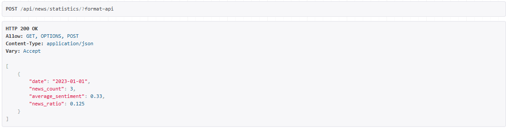

As part of the terms of reference, it is required to implement the logic of collecting, processing and API for issuing news on the cryptocurrency market. To do this, it is necessary: 

1. Create a cron job that pulls up the result of parsing news sites for one news item (mock data is attached) and writes them to the database.
2. Implement API methods

2.1.  News feed (see UI)

2.2 News statistics for a specific coin for a given period (the number of news per day, the ratio of news per coin to the total number of coins per day, the average sentiment per day). 

The implementation details (database schemas, API method signatures, and so on), additional functionality, and so on remain within your assumptions. However, if you still have questions or are unclear, please write! 

Stack: python, django and Prisma

# Cryptocurrency News Aggregator

This project implements a cryptocurrency news aggregation system with automated data collection and API endpoints for news retrieval and statistics.

## Features

- Automated news collection via cron jobs
- REST API endpoints for:
  - News feed with search capabilities
  - Coin-specific news statistics
  - Sentiment analysis results
- Database storage using Prisma
- Built with Python and Django

## Prerequisites

- Python 3.8+
-  Prisma
- Django and DRF

## Installation

1. Clone the repository:

```bash
git clone https://github.com/Wambong/cronscraper.git
cd cronscraper/
```

2. Create and activate a virtual environment:

```bash

source venv/bin/activate
cd cronjob
```
3. Install Python dependencies:

```bash
pip install -r requirements.txt
```

## load data to prisma db 
```commandline
python manage.py store_news

```

1. Start the Django development server:

```bash
python manage.py runserver
```


## API Endpoints

### News Feed

```bash
http://127.0.0.1:8000/api/news/
```


## search box 
### Query parameters
```commandline
 BTC or btc
```

## result


## News Statistics
### Query parameters:
## http://127.0.0.1:8000/api/news/statistics/

```bash
GET /api/news/statistics/
- `coin`: Filter by cryptocurrency (e.g., BTC, ETH)
- `date_from`: Start date (YYYY-MM-DD)
- `date_to`: End date (YYYY-MM-DD)
```
## example
```commandline
    {
        "ticker": "DOGE",
        "start_date": "2023-01-01",
        "end_date": "2023-01-10"
    }
```

## Result



Response includes:
- Daily news count
- News ratio per coin
- Average daily sentiment
